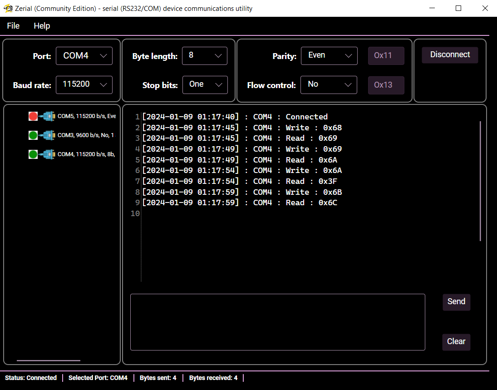

## Zerial is a RS232 (COM Port Devices) Exchange software

### 1. Key Feautes
Zerial is:
1. Fast like a lighting and a low resources consumption utility:
  * fast start, warm start < `3s`
  * **low memory consumption** < `100 Mb`
  * close to 0 `CPU` consumption (with a **properly working COM devices**) 
2. Convenient:
  * Exchange data with devices **in a binary format** in Hex mode
  * Support **multiple device at same time** (not really tested)
  * Support **multiple platforms** where Net6 could be installed (Avalonia is a Cross-Platform WPF)

### 2. Support
You could find **why and how to support us** [here](Support.md)

### 3. Install

#### 3.1 Windows

#### 3.2 Linux

### 4. Contributors

