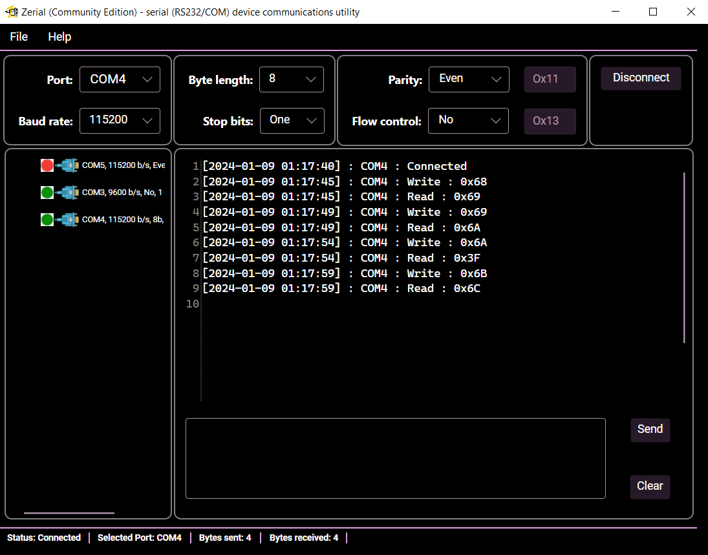

## Zerial is a RS232 (COM Port Devices) Exchange software

Zerial is a cross-platform GUI utility for interact with `COM` (`RS232`) devices. 

### 1. Key Features
`Zerial` is:
1. Fast like a lighting and a low resources consumption RS232 exchange `GUI` utility:
  * fast start, warm start < `3s`
  * **low memory consumption** < `100 Mb`
  * close to 0 `CPU` consumption (with a **properly working COM devices**) 
2. Convenient:
  * Exchange data with devices **in a binary format** in Hex mode
  * Support **multiple device at same time** (not really tested)
  * Support **multiple platforms** where `Net6` could be installed (`Avalonia` is a Cross-Platform WPF)
  * Support multiple localizations that could be added without re-compilation (see folder `./Assets/Languages`)



### 2. Support
[](https://boosty.to/wissance)

You could find **why and how to support us** [here](Support.md)

### 3. Install

Installation is available via:
1. [Chocolatey (see badge below in 3.1)](https://community.chocolatey.org/packages/wissance-zerial/1.1.0) 
2. [Snap (see badge below in 3.2)](https://snapcraft.io/wissance-zerial)
3. Using build installers (windows) in [Repository](./app/Wissance.Zerial/Wissance.Zerial.Installer/Windows)

#### 3.1 Windows

[](https://community.chocolatey.org/packages/wissance-zerial/1.1.0)

#### 3.2 Linux

[](https://snapcraft.io/wissance-zerial)

To make application work in SNAP:
```
sudo snap set system experimental.hotplug=true
sudo systemctl restart snapd.service
sudo snap connect wissance-zerial:serial-port
```

### 4 Run

Application could be run with the selected `Environment` profile that is defines application default configs i.e. `Logging`, by default `Environment` profile is `win-native` it meand that there should be a file with name `appsettings.win-native.json` with required `appsettings.json` in the **same directory** with executable application file. Snapcraft application is running with `snap` environment profile. Environment profile is passing via cmd line as follows:
```bash
./Wissance.Zerial.exe --environment=win-native
```

### 5. Contributors

<a href="https://github.com/Wissance/Zerial/graphs/contributors">
  
</a>
