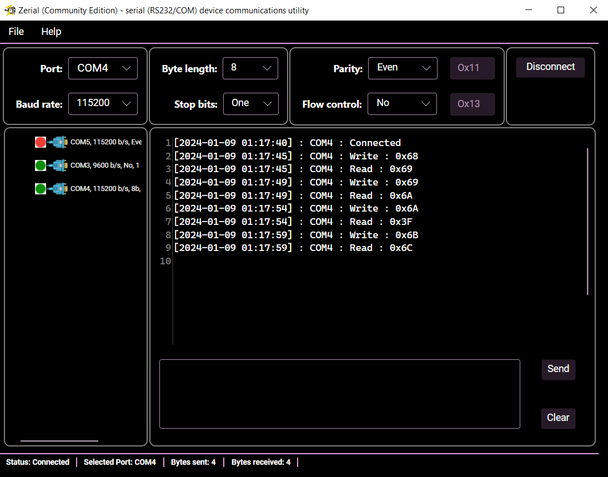

# Zerial: Cross-Platform RS232 (COM Port) Terminal


A modern, lightweight, and responsive **cross-platform GUI** serial port terminal built with **.NET** and **Avalonia UI**.

[](https://community.chocolatey.org/packages/wissance-zerial)
[](https://snapcraft.io/wissance-zerial)
[](https://boosty.to/wissance)

### 🎯 Core Application Principles
* **Minimalistic design:** A lightweight application without heavy analyzers, complex command builders, or cluttered interfaces.
* **Simplicity without compromise:** Exceptionally easy to use, yet far more capable than a raw terminal with a basic text prompt.


### 1. Key Features

* **High Performance & Low Resource Consumption:**
  * Fast launch (cold and warm start `< 3s`).
  * Low memory footprint (`< 100 MB`).
  * Close to 0% CPU consumption when communicating with correctly operating COM devices.
* **Developer-Friendly & Convenient:**
  * Streamlined data exchange in binary format via **HEX mode**.
  * Multi-port support (allows communicating with several devices simultaneously).
  * Multi-platform deployment everywhere `.NET` runs (*Avalonia UI acts as a modern cross-platform alternative to WPF*).
  * Out-of-the-box support for multiple localizations without re-compilation (configured via `./Assets/Languages`).



---

### 2. Installation

#### :computer: Windows
Zerial can be installed via Chocolatey or using a classic standalone installer built with InnoSetup:
* **Via Chocolatey:** `choco install wissance-zerial`
* **Standalone Installer:** Available in the [releases section](https://github.com/Wissance/Zerial/tree/master/app/Wissance.Zerial/Wissance.Zerial.Installer/Windows).

#### 🐧 Linux
The application is officially distributed as a Snap package.

[](https://snapcraft.io/wissance-zerial)

To ensure the Snap package has the required permissions to access hardware serial ports, execute the following commands:
```bash
sudo snap set system experimental.hotplug=true
sudo systemctl restart snapd.service
sudo snap connect wissance-zerial:serial-port
```

*Note: Your Linux user must belong to the `dialout` group to access serial interfaces (replace `$USER` with your actual username):*
```bash
sudo usermod -a -G dialout $USER
```

If you need to view active Snap slots or connect a USB-to-Serial converter interface manually, run:
```bash
snap interface serial-port
sudo snap connect wissance-zerial:wissance-zerial-serial-port snapd:usbserial
```

---

### 3. Usage & Configuration

The application can be launched with a specific `Environment` profile that defines default configurations (e.g., logging settings). 

By default, the profile is set to `win-native`. This means the application expects an `appsettings.win-native.json` file to coexist with the main `appsettings.json` in the same directory as the executable. 

The Snap version automatically forces the `snap` environment profile. You can manually specify a profile via the command line interface:
```bash
./Wissance.Zerial.exe --environment=win-native
```

---

### 4. Support the Project

You can help us maintain and improve Zerial:
* **Support us on Boosty:** [](https://boosty.to/wissance)
* **Other ways to contribute:** Read our detailed guide [here](Support.md).

---

### 5. Contributors

<a href="https://github.com/Wissance/Zerial/graphs/contributors">
  
</a>