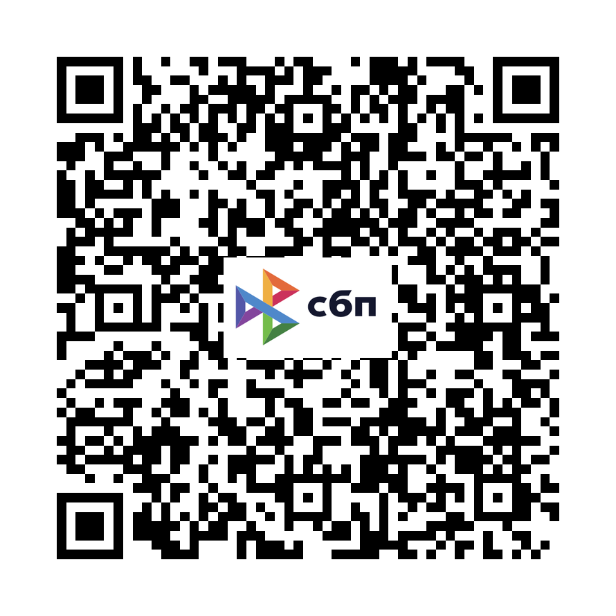

## SUPPORT
Wissabce LLC (ООО "Висанс") is a [Russian software and hardware company and we proud of this fact](https://wissance.com/en). We have both commercial and non-commercial projects. We are always tending to **share** with our **common solutions and general-purpose software** to make our own contributions to whole humanity knowledge and tools. `RS232` utility is the one of such thing, browsing Internet we were unable to discover **a convenient cross-platform** `GUI tool` that allows **to interact with multiple `RS232` devices**, therefore me have made our own. Developing even such simple utility took our time, and if you would like to thank us, you could make a donation, or if you would like that we were able to develop it in the future, you could support us in one of the following way.

Висанс (ООО "Висанс") - Российская (чем мы и гордимся) компания, которая занимается разработкой [программного обеспечения и электроники](https://wissance.com). При разрботке как коммерческих так и некоммерческих продуктов мы всегда стремимся открыть исходный код и сделать бесплатным софт общего назначения, одним из таких яавляется утилита `Zerial` - кросс-платформенное десктопное приложение для взаимодействия с множеством `RS232-устройств`. Если вы хотите поддержать наш труд, на который было затрачено время или хотите чтобы у нас была возможность развивать наш софт вы можете отблагодарить нас одним из способов, приведенных ниже.

#### 1. En
If you are not from `Russia` you could make a donation in one of the following way:

#### 2. Ru
Если вы из России и хотите нас отблагодарить, то это можно сделать одним из следующих способов. Данная поддержка является полностью добровольной и не обязывает нас (ООО "Висанс") ни к чему. Существуют следующие способы:

1. Перевод по номеру карты - `2204 4502 5474 5695`

2. ПО `QR-коду` (через СБП)

3. Через [Наш Boosty](boosty.to/wissance/single-payment/donation/536291/target)